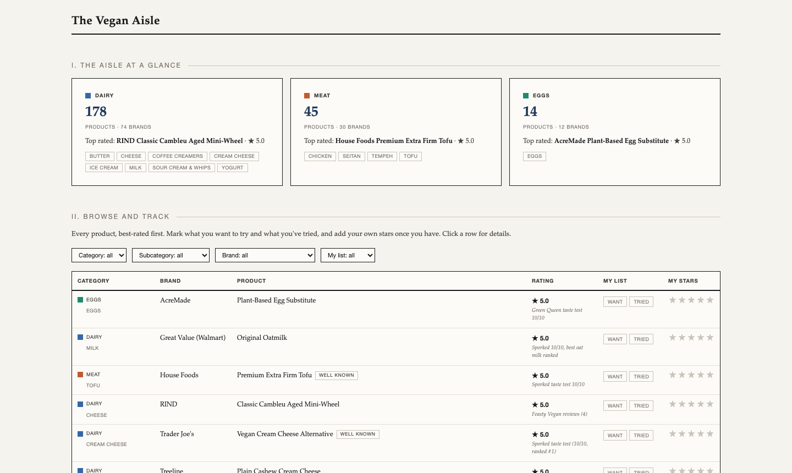

# The Vegan Aisle

A browsable catalog of 237 vegan products from 112 US brands across dairy, meat, and egg alternatives, ranked by published ratings, with a personal want-to-try and tried tracker.

**[View the live dashboard](https://meghnanatraj.github.io/vegan-aisle/)**

### [The Vegan Aisle dashboard](https://meghnanatraj.github.io/vegan-aisle/)

Every product sorted best-rated first, with filters by category, subcategory, and brand, plus buttons to mark what you want to try, what you have tried, and your own star rating.

## Key facts

- 237 products in 3 categories and 13 subcategories: dairy (cheese, butter, cream cheese, yogurt, sour cream and whips, coffee creamers, milk, ice cream), meat (chicken, seitan, tempeh, tofu), and eggs.
- 172 of the 237 products carry a published rating, drawn from retailer reviews (Target, Walmart, Amazon, Instacart) and editorial taste tests (Sporked, Tasting Table, Green Queen, Go Dairy Free), gathered in July 2026. The source is shown under each rating.
- The Worth Trying section ranks the best-reviewed products across the whole aisle; a Well Known tag marks the household names.
- Personal marks (want to try, tried, your stars) are saved in your own browser only and are not part of this repository.
- To update the catalog, edit `data/products.json`; the page computes every number from that file.

## What's in this repository

| Path | What it is |
|---|---|
| `index.html` | The dashboard page; all charts and tables are computed in the page from the data file |
| `data/products.json` | The full product table: category, subcategory, brand, product, rating, rating source, notes |
| `docs/assets/` | The screenshot used in this README |

Raw research sources (retailer listings and review pages) are not included; the data file is the complete record of what the dashboard shows.
